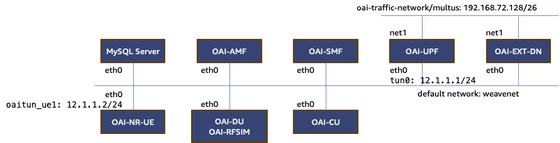

# Open Air Interface Migration to Kubernetes

This project aims to migrate the gNB and 5GC components of the Open Air Interface (OAI) to Kubernetes. Originally distributed as Docker containers, we have created Kubernetes artifacts with a new networking configuration. This migration removes the limitation of IP address hardcoding present in the original implementation. All gNB and 5GC pods dynamically find peer IP addresses. The implementation is done solely with Kubernetes YAML files and one additional container, called `config-updater`, which acts as the initContainer for special gNB pods such as CU and DU.

## Introduction

### Open Air Interface (OAI)
Open Air Interface is an open-source project that implements the 3GPP standards for 4G LTE and 5G networks. OAI provides a comprehensive platform for both radio access and core network functions, enabling researchers and developers to experiment and innovate with cellular network technologies.

### gNB (gNodeB)
gNodeB is the 5G term for a base station, which is responsible for communication between the mobile user equipment (UE) and the 5G core network. It comprises two main components:
- **CU (Central Unit)**: Handles higher-layer protocols and non-real-time functions.
- **DU (Distributed Unit)**: Manages real-time radio signal processing and lower-layer protocols.

### 5GC (5G Core)
The 5G Core network is the backbone of a 5G network, managing all control and data traffic. It includes various functions such as the AMF (Access and Mobility Management Function), SMF (Session Management Function), UPF (User Plane Function), and more, to ensure seamless connectivity and service delivery to end-users.

## Project Components

The gNB and 5GC pods include:

- **mysql**: Database for users, terminal information, and data for PDN (Packet Data Network) and PGW (Packet Gateway).
- **oai-amf**: Access and Mobility Management Function (AMF) of 5GC, responsible for registration, connection, reachability management, and mobility management.
- **oai-smf**: Session Management Function (SMF) of 5GC, handles session establishment, modification, and release.
- **oai-upf**: User Plane Function (UPF) of 5GC, forwards data packets between the RAN and the data network.
- **oai-ext-dn**: External Data Network (DN) test pod. You can ping this from the UE to test external network connectivity.
- **oai-cu**: Central Unit (CU) of gNB, manages higher layer protocols and connects to the 5G Core.
- **oai-du**: Distributed Unit (DU) of gNB, manages lower layer protocols and real-time radio signal processing.
- **oai-nr-ue**: New Radio User Equipment (NR UE), simulates a 5G mobile device that can access the UPF and ext-dn.

## Networking Diagram

The following diagram shows the networking among the pods:

### Networking Description

- **OAI-AMF**: Connects to the NR UE, OAI-DU, and OAI-SMF, managing mobility and session establishment.
- **OAI-SMF**: Manages sessions with the OAI-UPF and communicates with the AMF.
- **OAI-UPF**: Connects to the external data network (OAI-EXT-DN) and handles data traffic.
- **OAI-CU**: Communicates with the OAI-DU for real-time radio signal processing and with the AMF for control plane functions.
- **OAI-DU**: Connects directly to the NR UE, handling radio signal processing and connecting to the CU.

## Deployment Instructions

To deploy the gNB and 5GC pods, use the following scripts. Please run the scripts in the order provided:

1. `5gc-deployment.sh`: Deploys the 5G Core components including AMF, SMF, UPF, and the External Data Network & MySQL database.
2. `ran-deploy.sh`: Deploys the gNB components including CU and DU.
3. `nrue-deployment.sh`: Deploys the NR UE pod for simulating a 5G mobile device.

To clean up the environment, use the following scripts:

1. `nrue-decomission.sh`: Decommissions the NR UE pod.
2. `ran-decommission.sh`: Decommissions the gNB components (CU and DU).
3. `5gc-decommission.sh`: Decommissions the 5G Core components (AMF, SMF, UPF, and MySQL database).

## Additional Information

The `config-updater` container, implemented as an initContainer for special gNB pods, plays a crucial role in the dynamic IP address configuration, ensuring seamless communication among the pods without hardcoding IP addresses.

Feel free to reach out for any further assistance or information regarding the deployment and configuration of the OAI components on Kubernetes.
